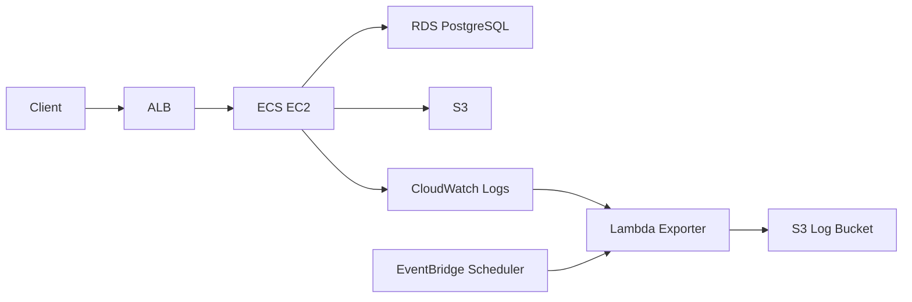

# 덕후감 서버

[](https://github.com/sprint-sb09-part03-team02/sb09-deokhugam-team02/actions/workflows/ci.yml?query=branch%3Amain)
[](https://codecov.io/gh/sprint-sb09-part03-team02/sb09-deokhugam-team02/tree/main)


덕후감은 도서 검색, 리뷰, 댓글, 알림, 인기 랭킹을 제공하는 도서 리뷰 플랫폼 백엔드입니다.

## 서비스

- 구현 홈페이지: http://deokhugam-alb-444789430.ap-northeast-2.elb.amazonaws.com/
- 헬스 체크: `/actuator/health`
- Swagger UI: `/swagger-ui/index.html`

## 주요 기능

| 구분 | 내용 |
| --- | --- |
| 도서 | 도서 등록, 수정, 삭제, 검색, 제목 정렬, ISBN OCR 추출, Naver Book API 연동 |
| 리뷰 | 리뷰 작성, 수정, 삭제, 좋아요, 인기 리뷰 조회 |
| 댓글 | 댓글 작성, 수정, 삭제, 리뷰 댓글 수 갱신 |
| 알림 | 이벤트 기반 알림 생성, 조회, 읽음 처리 |
| 랭킹 | Spring Batch 기반 인기 도서, 인기 리뷰, 파워 유저 집계 |
| 운영 | 요청 추적 로그, CloudWatch Logs, S3 로그 적재, Actuator 메트릭 |

## 기술 스택

| 구분 | 기술 |
| --- | --- |
| Backend | Java 17, Spring Boot, Spring Security, Spring Batch, Spring Actuator |
| Database | PostgreSQL, H2, JPA, QueryDSL, Flyway |
| Infra | AWS ECS EC2, ALB, ECR, RDS, S3, CloudWatch Logs, Secrets Manager |
| Test / CI/CD | JUnit5, Mockito, JaCoCo, Codecov, GitHub Actions |

## 아키텍처



## 실행

```bash
cd deokhugam
./gradlew bootRun
```

기본 로컬 프로필은 `local-h2`입니다. 운영 민감값은 AWS Secrets Manager와 GitHub Secrets에서 관리하며 저장소에 포함하지 않습니다.

## 테스트

```bash
cd deokhugam
./gradlew clean test jacocoTestReport jacocoTestCoverageVerification
```

프로젝트 전체 테스트 커버리지는 80% 이상을 기준으로 관리합니다.

## 문서

- [AWS 배포 및 운영 가이드](deokhugam/docs/AWS_DEPLOYMENT.md)
- [Postman 테스트 시나리오](deokhugam/docs/POSTMAN_TEST_SCENARIOS.md)
- [GitHub Actions 문서](.github/workflows/README.md)
