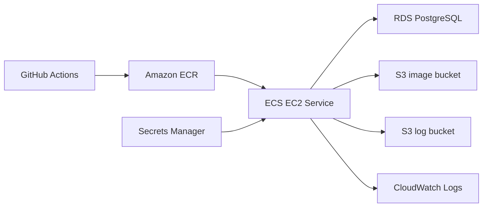

# AWS 배포 및 운영 가이드

이 문서는 덕후감 서버를 AWS ECS EC2 방식으로 배포하고, RDS, S3, Secrets Manager, CloudWatch Logs, GitHub Actions까지 운영 관점에서 확인하는 절차를 정리합니다.

## 전체 구조



## 핵심 리소스

| 리소스 | 값 |
| --- | --- |
| Region | `<aws-region>` |
| ECR repository | `<ecr-repository>` |
| ECS cluster | `<ecs-cluster>` |
| ECS service | `<ecs-service>` |
| ECS task family | `<ecs-task-family>` |
| Container name | `deokhugam-server` |
| Container port | `8080` |
| Runtime | ECS EC2, `linux/amd64`, bridge network |
| RDS | PostgreSQL |
| Image bucket | `<image-bucket>` |
| Log bucket | `<log-bucket>` |
| CloudWatch log group | `<cloudwatch-log-group>` |

## 네트워크 구성 체크

### VPC / Subnet

- ECS EC2 인스턴스와 RDS는 같은 VPC에 둡니다.
- ECS EC2 인스턴스는 ECR 이미지 pull과 외부 API 호출이 가능해야 합니다.
- RDS는 Public access를 끄고, ECS 보안그룹에서만 접근하도록 구성합니다.

### Security Group

| Security Group | Inbound | Source |
| --- | --- | --- |
| ECS SG | `8080` | 테스트/접속 대상 IP 또는 ALB SG |
| ECS SG | `22` | 운영자 IP, 필요 시에만 임시 허용 |
| RDS SG | `5432` | ECS SG |
| RDS SG | `5432` | 운영자 IP, DB 클라이언트 직접 점검 시에만 임시 허용 |

RDS 연결 장애가 발생하면 먼저 RDS SG의 `5432` inbound source가 ECS SG인지 확인합니다.

## Secrets Manager

컨테이너 런타임 민감값은 GitHub Secrets가 아니라 AWS Secrets Manager에서 관리합니다.

`task-definition.json`에서 참조하는 키:

| Key | 용도 |
| --- | --- |
| `SPRING_DATASOURCE_URL` | RDS JDBC URL |
| `SPRING_DATASOURCE_USERNAME` | RDS 사용자명 |
| `SPRING_DATASOURCE_PASSWORD` | RDS 비밀번호 |
| `NAVER_CLIENT_ID` | Naver 검색 API client id |
| `NAVER_CLIENT_SECRET` | Naver 검색 API secret |
| `OCR_SPACE_API_KEY` | OCR Space API key |

현재 인증 구조는 `Deokhugam-Request-User-ID` 헤더 기반입니다. `JWT_SECRET`, `JWT_EXPIRATION`은 task definition secrets에 넣지 않습니다.

## ECS Task Definition

현재 task definition은 루트의 `task-definition.json`을 기준으로 관리합니다.

주요 설정:

| 항목 | 값 |
| --- | --- |
| `requiresCompatibilities` | `EC2` |
| `networkMode` | `bridge` |
| `cpu` | `512` |
| `memory` | `768` |
| `runtimePlatform.cpuArchitecture` | `X86_64` |
| `executionRoleArn` | `ecsTaskExecutionRole` |
| `taskRoleArn` | `<ecs-task-role>` |
| Health check | `curl -f http://localhost:8080/actuator/health || exit 1` |

컨테이너 환경변수:

| Key | 값 |
| --- | --- |
| `SPRING_PROFILES_ACTIVE` | `dev` |
| `AWS_REGION` | `<aws-region>` |
| `AWS_S3_BUCKET` | `<image-bucket>` |
| `LOG_FILE_PATH` | `/app/logs` |
| `S3_LOG_BUCKET` | `<log-bucket>` |
| `S3_LOG_PREFIX` | `app` |
| `S3_LOG_DELETE_AFTER_UPLOAD` | `false` |

## Docker 이미지

ECS EC2 인스턴스가 `linux/amd64` 환경이므로 이미지는 반드시 amd64로 빌드합니다.

```bash
cd deokhugam
docker build --platform linux/amd64 -t <ecr-repository>:latest .
```

Dockerfile은 non-root `appuser`로 애플리케이션을 실행합니다. 파일 로그를 쓰기 위해 `/app/logs`를 생성하고 `/app` 소유권을 `appuser:appgroup`으로 변경합니다.

```dockerfile
RUN mkdir -p /app/logs && chown -R appuser:appgroup /app
```

이 설정이 없으면 Logback 파일 appender가 `/app/logs`에 파일을 만들지 못해 컨테이너가 시작 중 종료될 수 있습니다.

## S3 로그 적재

### 애플리케이션 로그 생성

`logback-spring.xml`에서 콘솔 로그와 파일 로그를 동시에 남깁니다.

| 항목 | 값 |
| --- | --- |
| 현재 로그 | `/app/logs/deokhugam.log` |
| 날짜별 로그 | `/app/logs/deokhugam.yyyy-MM-dd.log` |
| 보관 기간 | `7일` |
| MDC 필드 | `requestId`, `clientIp` |

### S3 업로드 스케줄

`DailyLogUploadScheduler`가 매일 `01:00 Asia/Seoul`에 전날 로그 파일을 S3로 업로드합니다. 배치 시작 로그를 먼저 남겨 Logback 날짜 롤링을 유도한 뒤, 전날 로그 파일을 업로드합니다.

업로드 경로:

```text
s3://<log-bucket>/app/yyyy/MM/dd/deokhugam.yyyy-MM-dd.log
```

### S3 Lifecycle 권장값

| Prefix | Transition | Expiration |
| --- | --- | --- |
| `app/` | 30일 후 Standard-IA 또는 Glacier 계층 | 90일 또는 프로젝트 제출 이후 삭제 |

팀 프로젝트 비용 최소화가 목적이면 로그 버킷은 장기 보관하지 않고 만료 정책을 설정합니다.

## IAM 권한

### GitHub Actions 배포용 IAM User

필요 권한:

- ECR 로그인 및 push
- ECS task definition 등록
- ECS service update
- `<ecs-task-execution-role>`, `<ecs-task-role>`에 대한 `iam:PassRole`

### `ecsTaskExecutionRole`

컨테이너 시작에 필요한 권한:

- ECR image pull
- CloudWatch Logs write
- Secrets Manager `GetSecretValue`

### `<ecs-task-role>`

애플리케이션 런타임에서 필요한 권한:

- `<image-bucket>` 이미지 업로드/조회/삭제
- `<log-bucket>/app/*` 로그 업로드

로그 업로드 최소 권한 예시:

```json
{
  "Version": "2012-10-17",
  "Statement": [
    {
      "Sid": "S3DailyLogUpload",
      "Effect": "Allow",
      "Action": "s3:PutObject",
      "Resource": "arn:aws:s3:::<log-bucket>/app/*"
    }
  ]
}
```

## CI/CD 흐름

`main` 브랜치에 push되거나 수동 실행하면 CD가 수행됩니다.

1. Gradle 테스트 및 커버리지 검증
2. Docker `linux/amd64` 이미지 빌드
3. ECR에 `${github.sha}`, `latest` 태그 push
4. `task-definition.json`의 `${AWS_ACCOUNT_ID}` 치환
5. ECS task definition 새 revision 등록
6. ECS service 업데이트
7. service stability 대기

## 배포 후 검증

### ECS 상태

```bash
aws ecs describe-services \
  --cluster <ecs-cluster> \
  --services <ecs-service> \
  --region <aws-region>
```

확인할 값:

- `desiredCount = 1`
- `runningCount = 1`
- `pendingCount = 0`
- 최신 task definition revision 사용

### Health Check

```bash
curl http://{public-ip}:8080/actuator/health
```

정상 응답:

```json
{"status":"UP"}
```

### Batch Metrics

```bash
curl http://{public-ip}:8080/actuator/metrics
curl http://{public-ip}:8080/actuator/metrics/deokhugam.batch.job.completed
curl http://{public-ip}:8080/actuator/metrics/deokhugam.batch.job.last.success
```

Batch가 한 번 이상 실행된 뒤 메트릭 값이 표시됩니다.

### S3 로그 적재

스케줄 기준 다음날 `00:10 KST` 이후 아래 경로를 확인합니다.

```text
s3://<log-bucket>/app/yyyy/MM/dd/
```

객체가 없다면 아래 순서로 확인합니다.

1. ECS task definition의 `LOG_FILE_PATH`, `S3_LOG_BUCKET`, `S3_LOG_PREFIX`
2. 컨테이너가 하루 전 로그 파일을 실제로 생성했는지
3. `<ecs-task-role>`에 `s3:PutObject` 권한이 있는지
4. CloudWatch Logs에서 `S3_LOG_UPLOAD_FAILED` 또는 skip 로그가 있는지

## 트러블슈팅

### `no matching manifest for linux/amd64`

원인: ARM 이미지가 ECR에 올라갔거나 베이스 이미지가 amd64 manifest를 제공하지 않는 경우입니다.

해결:

```bash
docker buildx build --platform linux/amd64 -t <ecr-repository>:<tag> --load .
```

### `CannotPullContainerError`

확인 순서:

1. ECR 이미지 태그가 실제로 존재하는지
2. ECS EC2 인스턴스가 ECR에 접근 가능한지
3. `ecsTaskExecutionRole`에 ECR pull 권한이 있는지
4. task definition image URI가 올바른지

### `Retrieved secret ... did not contain json key`

원인: task definition의 `secrets.valueFrom`에 지정한 JSON key가 Secrets Manager에 없습니다.

해결:

- 실제 필요한 key만 task definition에 남깁니다.
- 현재 구조에서는 `JWT_SECRET`, `JWT_EXPIRATION`을 제거합니다.

### 컨테이너 `exitCode=1`

확인 순서:

1. CloudWatch Logs 확인
2. DB 연결 정보/보안그룹 확인
3. Flyway schema validation 확인
4. `/app/logs` 권한 확인

S3 파일 로그 도입 후에는 `/app/logs` 쓰기 권한이 없으면 시작 중 실패할 수 있습니다.

### RDS 접속 실패

확인 순서:

1. RDS public access 여부
2. RDS SG inbound `5432`
3. source가 ECS SG 또는 현재 접속자 IP인지
4. DB name, username, password
5. `SPRING_DATASOURCE_URL` 형식

JDBC URL 예시:

```text
jdbc:postgresql://{rds-endpoint}:5432/deokhugam
```
