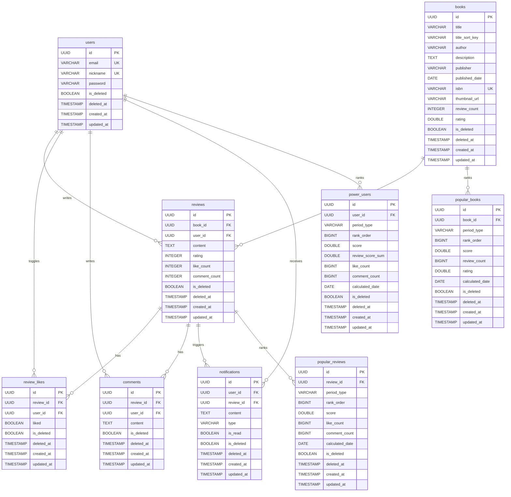

# ERD

기준 파일:
- `deokhugam/src/main/resources/db/migration/V1__init_schema.sql`
- `deokhugam/src/main/resources/db/migration/V2__repair_schema_to_match_entities.sql`
- `deokhugam/src/main/resources/db/migration/V3__create_spring_batch_metadata_tables.sql`
- `deokhugam/src/main/resources/db/migration/V4__add_book_title_sort_key.sql`
- `deokhugam/src/main/resources/db/migration/V5__replace_review_unique_constraint_with_partial_index.sql`
- `deokhugam/src/main/resources/db/migration/V7__rebuild_book_title_sort_key_character_groups.sql`
- `deokhugam/src/main/resources/static/api.json`

## Notes

- `popular_books`, `popular_reviews`, `power_users`는 집계/랭킹 스냅샷 테이블입니다.
- 모든 영속 테이블에 `is_deleted`, `deleted_at`을 포함해 soft delete 규칙을 반영했습니다.
- `books.title_sort_key`는 제목 정렬 전용 컬럼입니다. 숫자, 영문, 한글, 기타 문자 그룹을 분리해 정렬하고, 기존 데이터는 Flyway V7에서 재계산합니다.
- `reviews`는 활성 리뷰만 `(book_id, user_id)` 중복을 막는 부분 유니크 인덱스 `ux_reviews_active_book_user`를 사용합니다.
- Spring Batch 메타테이블(`BATCH_*`)은 배치 실행 이력 관리용 시스템 테이블이라 도메인 ERD 관계도에서는 제외했습니다.
- `NaverBookDto`, OCR 요청 스키마처럼 외부 조회/임시 입력 성격의 스키마는 ERD에서 제외했습니다.
