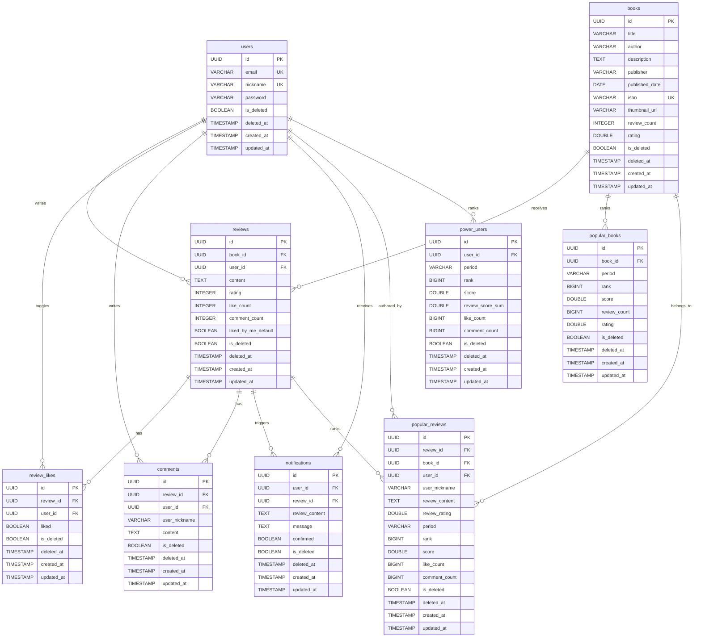

# ERD

기준 파일:
- `deokhugam/src/main/resources/schema.sql`
- `deokhugam/src/main/resources/static/api.json`

## Notes

- `popular_books`, `popular_reviews`, `power_users`는 집계/랭킹 스냅샷 테이블입니다.
- 모든 영속 테이블에 `is_deleted`, `deleted_at`을 포함해 soft delete 규칙을 반영했습니다.
- `NaverBookDto`, OCR 요청 스키마처럼 외부 조회/임시 입력 성격의 스키마는 ERD에서 제외했습니다.
